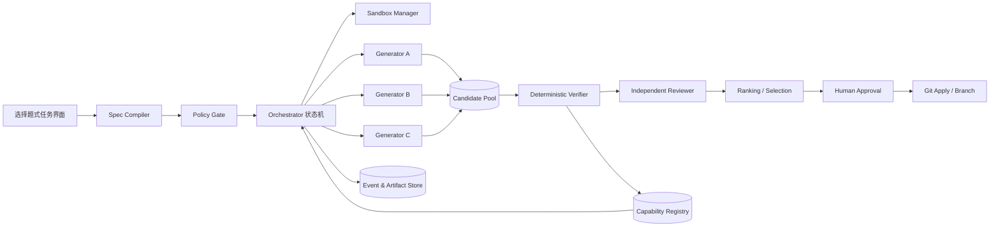

# ForestFix 项目文档：可验证的多 Agent Python 修复系统

> **文档性质**：产品方案 + 技术设计 + MVP 实施路线
> **版本**：v0.1
> **核心原则**：领域聚焦、选择题交互、Spec 驱动、测试驱动、候选并行、独立验证、严格沉淀。

---

## 1. 项目摘要

ForestFix 是一个面向 **Python 开源仓库 Bug 修复** 的多 Agent 系统。用户不需要编写复杂 Prompt，只需选择仓库、任务类型、允许修改的范围和验收命令；系统会把输入编译成结构化 Spec，在隔离环境中生成多个候选补丁，独立运行测试和静态检查，只向用户展示通过硬性验证的结果。

系统不会让多个 Agent 围绕同一份答案反复争论和修改，而采用以下流水线：

> **任务结构化 → 独立生成候选 → 确定性验证 → 独立审查 → 人工批准 → 合并 → 能力沉淀**

长期目标是形成一个小而可靠的能力库：库中不是保存“Agent 说过的话”，而是保存带适用范围、来源、测试、版本和历史成功率的修复策略、检查器与工具。

### 1.1 一句话定位

**给定一个可复现的 Python Bug，自动生成并验证修复补丁，只把有测试证据的候选交给用户。**

### 1.2 为什么先选这个领域

Python Bug 修复具备适合“森林模型”的四个条件：

1. 输入边界清晰：仓库、Issue、复现步骤、允许修改的目录；
2. 输出形式明确：Git diff、测试补充、验证报告；
3. 存在机器可执行的 Oracle：pytest、静态检查、复现脚本；
4. 失败成本可控：候选方案在容器或 Git worktree 中隔离，不直接修改主分支。

因此，第一版不做“任何事情都能做”的通用 Agent，也不从数学证明、EDA 或桌面全场景主动助手起步。

---

## 2. 对原始想法的梳理与完善

原始材料包含七个有价值的产品判断，但要落地还需要补上工程边界。

| 原始判断 | 工程化表达 | ForestFix 中的实现 |
|---|---|---|
| 先聚焦一个领域 | 明确支持矩阵和拒绝条件 | MVP 只支持带可运行测试的 Python 仓库 |
| 让用户做选择题 | 把自然语言编译成结构化任务 | 表单 + 少量补充文本，生成 `TaskSpec` |
| Spec-Driven | Spec 必须可存储、可校验、可版本化 | Pydantic JSON Schema；运行前完成一致性检查 |
| Test-Driven | 测试不只是“跑一下”，而是合并硬门槛 | 复现测试、回归测试、静态检查、变更范围检查 |
| 主动 Agent | 主动性应有触发器、权限边界和冷却机制 | 后期监听 CI 失败或 GitHub webhook，只建议，不自动合并 |
| 多 Agent 分工 | Agent 之间传递结构化产物，而不是闲聊 | 候选补丁、验证报告、审查报告均为不可变工件 |
| 共享知识库 | 不是聊天记忆或向量库，而是经过验证的能力注册表 | 只收录带测试、适用条件、版本和来源的 Capability |

### 2.1 最重要的补充：先定义什么算“真”

多 Agent 数量不是可靠性的来源，**可执行验证标准才是**。系统采用以下优先级：

1. 确定性测试结果；
2. 安全与权限规则；
3. 结构化静态分析；
4. 独立 LLM 审查；
5. 生成 Agent 的自我评价。

低优先级结果不得推翻高优先级结果。例如，任何 Agent 都不能用“我认为修好了”覆盖失败的测试。

### 2.2 “默认质疑”不等于无限重试

每个候选默认不可信，但系统不允许 Agent 无限互相修改：

- 生成者提交候选后，候选冻结；
- 验证者只出报告，不直接修改候选；
- 失败候选被拒绝或最多触发一次携带失败证据的重新生成；
- 每个任务设置候选数、最大轮次、Token 和运行时预算；
- 没有候选通过时，系统诚实返回失败原因，不拼凑答案。

### 2.3 主动性应晚于可靠性

“持续观察屏幕”在第一版中既难验证，也有隐私和打扰风险。更稳妥的顺序是：

1. 先做好用户显式发起的 Bug 修复；
2. 再接入 CI 失败、Issue 标签、依赖告警等明确事件；
3. 主动 Agent 只生成任务建议；
4. 获得用户批准后才运行；
5. 永不默认推送代码或合并 PR。

---

## 3. 产品目标与非目标

### 3.1 MVP 目标

用户提供一个本地或远程 Python 仓库后，系统能够：

1. 检查仓库是否满足运行条件；
2. 通过选择题生成无歧义的任务 Spec；
3. 在隔离 worktree/容器中复现失败；
4. 并行生成 2～3 个相互独立的修复候选；
5. 对每个候选运行相同的确定性验证；
6. 拒绝越权、测试失败或引入回归的候选；
7. 输出通过候选的 diff、验证证据、风险和应用命令；
8. 经用户明确批准后，才应用补丁或创建分支。

### 3.2 MVP 非目标

以下能力暂不实现：

- 支持所有语言和所有构建系统；
- 无测试、不可复现的开放式需求；
- 自动合并到主分支；
- 自动发布、部署或修改生产环境；
- 让 Agent 自由发明 shell 命令并在宿主机执行；
- 以向量相似度直接决定某条知识是否可信；
- 十几个角色彼此开会、投票或无限辩论；
- 持续截屏监控用户桌面。

### 3.3 拒绝条件

出现以下任一情况，任务应在生成候选前被拒绝或要求用户补充信息：

- 仓库无法安装或测试基线无法运行；
- 没有复现命令，也无法生成稳定复现用例；
- 要求读取仓库外敏感目录；
- 要求自动处理密钥、支付、生产数据或高风险权限；
- 验收标准只能依靠主观判断；
- 修改范围与用户授权不一致。

---

## 4. 目标用户与核心场景

### 4.1 目标用户

- 想参与 Python OSS 贡献、但不熟悉陌生代码库的开发者；
- 维护中小型 Python 项目、希望减少重复修复工作的个人或小团队；
- 研究可验证 Agent 工作流的开发者。

### 4.2 核心用户故事

#### 场景 A：本地失败测试

用户选择仓库和失败测试，ForestFix 复现错误、生成多个修复，在完整测试通过后展示最佳补丁。

#### 场景 B：GitHub Issue 修复

用户粘贴 Issue URL，系统提取描述，但仍要求用户确认任务类型、修改范围和验收命令；不能仅凭 Issue 文本直接开工。

#### 场景 C：CI 主动建议（后续版本）

系统收到 CI 失败 webhook，生成一条“可修复任务建议”；用户批准后才进入候选生成流程。

---

## 5. 交互设计：让用户做选择题

### 5.1 新建任务表单

必选项：

1. **代码来源**：本地仓库 / Git URL；
2. **任务类型**：失败测试 / 明确异常 / 回归 Bug / CI 失败；
3. **目标分支**；
4. **复现方式**：已有测试命令 / 复现脚本；
5. **允许修改范围**：指定目录或文件；
6. **禁止修改项**：依赖、公开 API、数据库 Schema 等；
7. **验收命令**：目标测试 + 回归测试；
8. **最大预算**：候选数、运行时间、模型花费；
9. **完成后的动作**：只生成报告 / 创建本地分支 / 起草 PR。

自由文本仅用于补充现象，不承担定义验收标准的责任。

### 5.2 运行前确认页

系统将表单转换为人可读的 Spec，并要求用户确认：

- 要修什么；
- 不允许改什么；
- 系统会运行哪些命令；
- 哪些条件全部满足才算成功；
- 最大资源消耗；
- 成功后是否有外部副作用。

### 5.3 结果页

每个通过候选展示：

- 修改摘要和完整 diff；
- 新增测试及其意义；
- 目标测试、回归测试、静态检查结果；
- 变更范围与安全检查结果；
- 独立审查发现的风险；
- 与其他通过候选的差异；
- “应用到本地分支”按钮。

失败候选不必默认展示完整内容，但应保留失败阶段、错误摘要和日志入口。

---

## 6. 系统架构



### 6.1 核心组件

#### Spec Compiler

将表单和补充描述编译为 `TaskSpec`，检查字段完整性、命令白名单、路径边界及验收条件是否可执行。

#### Policy Gate

在任何模型或 shell 运行前完成安全决策。它不使用 LLM 决定权限，所有规则都应是可审计的确定性代码。

#### Orchestrator

负责状态迁移、任务预算、并发、超时、重试和取消。它是有限状态机，不是一个会自由发挥的“总经理 Agent”。

#### Sandbox Manager

为基线和每个候选创建独立 Git worktree，并在受限容器中执行安装、测试和静态检查。候选间不能共享工作目录。

#### Generators

每个生成者只读取同一份 TaskSpec、基线日志和允许的仓库内容，独立提交补丁。生成者之间不读取彼此的思考或补丁，避免锚定和群体趋同。

#### Deterministic Verifier

对所有候选执行同一套验证矩阵。它是系统的主要可信根。

#### Independent Reviewer

在不知道生成者身份和自评分的情况下审查通过硬门槛的候选，检查测试作弊、过拟合、异常复杂度、错误处理和潜在副作用。Reviewer 只能给出结构化报告，不能直接修改代码。

#### Capability Registry

保存经多次验证的修复策略、检测器和工具。它不是普通 RAG 文档库；每条能力都必须有范围、版本、来源和证据。

---

## 7. Agent 分工与通信协议

### 7.1 最小角色集合

MVP 只需要四类角色：

1. **Spec Agent**：把用户补充描述整理成结构化约束，但无权降低验收标准；
2. **Generator Agent**：分析代码并提交候选补丁；
3. **Reviewer Agent**：独立寻找逻辑缺陷和测试作弊；
4. **Curator Agent**：判断一个已验证的方法是否值得进入能力库。

测试运行、权限判断、排序硬规则、Git 操作都由普通程序完成，不交给 Agent。

### 7.2 禁止自由聊天

Agent 之间只通过以下工件通信：

- `task_spec.json`
- `baseline_report.json`
- `candidate.patch`
- `candidate_manifest.json`
- `verification_report.json`
- `review_report.json`
- `capability_proposal.json`

所有工件应不可变、带时间戳、内容哈希和来源 ID。修改意味着创建新版本，而不是覆盖旧内容。

### 7.3 候选处理规则

- 每个生成者提交一个完整候选；
- 生成者不得声称自己的结果已通过测试；
- 验证者在全新环境中应用候选并测试；
- 确定性硬门槛失败即淘汰；
- Reviewer 只审查通过硬门槛的候选；
- 最终排序只在合格候选之间进行；
- 若全部失败，返回证据和下一步建议，不进行“多数投票”。

---

## 8. 工作流与状态机

```text
DRAFT
  → SPEC_READY
  → POLICY_APPROVED
  → BASELINE_REPRODUCED
  → GENERATING
  → VERIFYING
  → REVIEWING
  → AWAITING_APPROVAL
  → APPLIED
  → COMPLETED
```

任意阶段可进入：

```text
REJECTED | FAILED | CANCELLED | BUDGET_EXCEEDED
```

### 8.1 详细流程

1. 用户完成选择题表单；
2. Spec Compiler 生成 TaskSpec；
3. Policy Gate 检查路径、命令、权限和副作用；
4. 基线环境执行复现命令，确认失败真实存在；
5. 并行创建 2～3 个候选 worktree；
6. 各 Generator 独立分析并提交 patch；
7. Verifier 在新环境中依次运行验证矩阵；
8. 淘汰未通过硬门槛的候选；
9. Reviewer 对剩余候选做盲审；
10. 系统按确定性规则排序；
11. 用户查看证据并选择候选；
12. 用户明确批准后，系统创建分支并应用 patch；
13. 高复用价值的方法进入 Capability 提案队列；
14. 只有额外测试和人工批准通过后，Capability 才发布。

---

## 9. 核心数据结构

### 9.1 TaskSpec

```json
{
  "task_id": "uuid",
  "repo": {
    "source": "local-or-git-url",
    "revision": "immutable-commit-sha"
  },
  "task_type": "failing_test",
  "problem_statement": "test_parser_rejects_empty_header fails",
  "reproduction": {
    "command": ["pytest", "tests/test_parser.py::test_parser_rejects_empty_header", "-q"],
    "expected_baseline": "fail"
  },
  "scope": {
    "allow": ["src/parser/**", "tests/test_parser.py"],
    "deny": ["pyproject.toml", ".github/**"]
  },
  "constraints": {
    "public_api_change": false,
    "dependency_change": false,
    "network_access": false
  },
  "acceptance": [
    {"command": ["pytest", "tests/test_parser.py", "-q"], "must_pass": true},
    {"command": ["pytest", "-q"], "must_pass": true},
    {"command": ["ruff", "check", "."], "must_pass": true}
  ],
  "budget": {
    "candidate_count": 3,
    "max_rounds": 1,
    "wall_time_seconds": 1800
  },
  "post_action": "report_only"
}
```

实际实现中，命令必须以参数数组存储并由白名单执行器运行，不能拼接后交给 shell。

### 9.2 CandidateManifest

```json
{
  "candidate_id": "uuid",
  "task_id": "uuid",
  "generator": "provider/model/config-version",
  "base_commit": "sha",
  "patch_sha256": "sha256",
  "changed_files": ["src/parser/core.py", "tests/test_parser.py"],
  "claimed_strategy": "validate header before tokenization",
  "created_at": "RFC3339 timestamp"
}
```

### 9.3 VerificationReport

必须包含：

- 基线 Commit 与环境指纹；
- Patch 哈希；
- 每条命令的退出码、耗时和日志位置；
- 变更范围检查；
- 测试新增/删除统计；
- 可疑跳过测试、删除断言、修改测试配置等作弊检测；
- 最终硬门槛结论。

### 9.4 Capability

```yaml
id: pytest-fixture-state-leak-detector
version: 1.0.0
scope:
  language: python
  framework: pytest
  symptom: order-dependent-test-failure
inputs:
  - repository_path
outputs:
  - evidence_report
runner: capabilities/pytest_state_leak/run.py
tests: capabilities/pytest_state_leak/tests/
provenance:
  source_task_ids: [task-123, task-456]
validation:
  benchmark_pass_rate: 0.96
  last_verified_environment: python-3.12
status: approved
```

仅有 Prompt、自然语言建议或一次成功记录的内容，不得成为已发布 Capability。

---

## 10. 验证与候选排序

### 10.1 硬门槛

候选必须全部满足：

1. Patch 可干净应用到固定基线 Commit；
2. 修改文件全部在允许范围内；
3. 复现测试从失败变为通过；
4. 用户指定的回归测试全部通过；
5. 未删除、跳过或弱化关键测试；
6. 未新增未授权依赖；
7. 静态检查满足仓库原有要求；
8. 无已知高危安全问题；
9. 运行时间和资源消耗未越界。

### 10.2 软排序

只对通过硬门槛的候选进行排序，可考虑：

- 修改行数更少；
- 新增针对性回归测试；
- 与仓库既有设计一致；
- API 兼容性更好；
- 圈复杂度增量更低；
- Reviewer 风险更低。

不要把多个弱指标简单加权成一个看似精确的“真理分数”。结果页应保留每项证据，允许用户判断取舍。

### 10.3 防测试作弊

Verifier 需要显式检查：

- 删除或重命名失败测试；
- 增加 `skip`、`xfail` 或条件绕过；
- 弱化断言；
- 修改 pytest 收集配置；
- Catch 过宽异常后静默返回；
- 硬编码当前测试样例；
- 更改依赖版本掩盖问题。

---

## 11. 能力库设计

### 11.1 三层存储

1. **Raw Artifacts**：所有候选、日志和审查报告，仅供追溯；
2. **Quarantine**：看起来可复用但证据不足的能力提案；
3. **Approved Registry**：通过基准测试、人工批准并带版本的能力。

只有第三层能被默认检索和执行。

### 11.2 发布门槛

一个 Capability 至少需要：

- 明确输入、输出和适用范围；
- 可执行实现，而不只是自然语言经验；
- 独立单元测试；
- 至少一个负例或反例测试；
- 来源和许可证信息；
- 沙箱权限声明；
- 在小型基准集上验证；
- 版本号和回滚方式；
- 人工批准。

### 11.3 生命周期

```text
PROPOSED → QUARANTINED → BENCHMARKED → APPROVED
                               ↘ REJECTED
APPROVED → DEPRECATED → RETIRED
```

当依赖版本、Python 版本或目标框架变化时，应重新验证；过期能力不能因为曾经通过就永久可信。

---

## 12. 安全与权限边界

### 12.1 默认安全策略

- 生产代码执行只发生在容器中；MVP 的本地执行器仅允许显式可信 fixture 模式；
- 容器默认断网；
- 仓库以只读基线挂载，候选写入独立工作区；
- 不挂载 SSH key、云凭证、浏览器 Cookie 或用户主目录；
- 限制 CPU、内存、进程数、磁盘和运行时间；
- Shell 命令使用白名单和参数数组；
- 禁止特权容器和宿主 Docker socket；
- 所有外部副作用必须单独授权；
- PR 创建与 PR 合并是两种不同权限，MVP 不提供自动合并。

### 12.2 仓库内容不可信

README、Issue、测试日志和源代码中都可能包含 Prompt Injection。系统必须把它们视为数据：

- 仓库文本不能改变系统权限；
- 仓库指令不能要求读取仓库外文件；
- Generator 无权修改 Policy；
- Verifier 不采纳代码中的自然语言“测试已通过”声明；
- 所有工具调用仍受路径和命令策略控制。

---

## 13. 技术选型

### 13.1 MVP 推荐栈

- **语言**：Python 3.12；
- **API**：FastAPI；
- **Schema**：Pydantic；
- **数据库**：SQLite（MVP），后续按并发需要迁移 PostgreSQL；
- **任务执行**：进程内队列 + 持久化状态机，暂不引入复杂消息中间件；
- **隔离**：Git worktree + rootless Docker/Podman；
- **测试**：pytest；
- **静态检查**：ruff，按目标仓库配置选用 mypy/bandit；
- **界面**：服务端模板 + HTMX，优先做清晰表单和证据页；
- **模型适配**：统一 Provider 接口，避免业务逻辑绑定单一模型；
- **日志**：结构化 JSON 日志 + 工件文件；
- **追踪**：每次运行统一 `run_id/task_id/candidate_id`。

### 13.2 为什么不在 MVP 使用重型框架

项目的难点是状态、隔离、验证和证据，不是画出复杂 Agent 图。第一版不需要先引入 Kubernetes、Kafka、Temporal 或大型多 Agent 框架。边界清晰的 Python 模块和数据库状态机更易调试，也更能证明方法本身是否有效。

---

## 14. 建议仓库结构

```text
forestfix/
├── README.md
├── pyproject.toml
├── src/forestfix/
│   ├── api/
│   │   ├── app.py
│   │   ├── routes_tasks.py
│   │   └── schemas.py
│   ├── domain/
│   │   ├── task_spec.py
│   │   ├── candidate.py
│   │   ├── reports.py
│   │   └── capability.py
│   ├── orchestration/
│   │   ├── state_machine.py
│   │   ├── scheduler.py
│   │   └── budgets.py
│   ├── policy/
│   │   ├── command_policy.py
│   │   ├── path_policy.py
│   │   └── side_effects.py
│   ├── sandbox/
│   │   ├── worktrees.py
│   │   ├── containers.py
│   │   └── executor.py
│   ├── agents/
│   │   ├── provider.py
│   │   ├── generator.py
│   │   ├── reviewer.py
│   │   └── curator.py
│   ├── verification/
│   │   ├── pipeline.py
│   │   ├── scope_check.py
│   │   ├── test_runner.py
│   │   ├── cheat_detection.py
│   │   └── ranking.py
│   ├── registry/
│   │   ├── store.py
│   │   ├── promotion.py
│   │   └── retrieval.py
│   └── storage/
│       ├── database.py
│       └── artifact_store.py
├── web/
│   ├── templates/
│   └── static/
├── capabilities/
│   └── README.md
├── tests/
│   ├── unit/
│   ├── integration/
│   ├── security/
│   └── fixtures/repos/
└── docs/
    ├── architecture.md
    ├── threat-model.md
    └── capability-format.md
```

---

## 15. 内部 API 草案

```text
POST   /tasks                     创建草稿任务
POST   /tasks/{id}/compile-spec   编译并校验 Spec
POST   /tasks/{id}/approve        用户批准运行
POST   /tasks/{id}/cancel         取消任务
GET    /tasks/{id}                获取状态
GET    /tasks/{id}/events         获取事件流
GET    /tasks/{id}/candidates     获取候选摘要
GET    /candidates/{id}/diff      获取完整 diff
GET    /candidates/{id}/report    获取验证与审查报告
POST   /candidates/{id}/apply     经批准应用到本地分支
GET    /capabilities              查看已批准能力
POST   /capabilities/{id}/promote 人工批准能力发布
```

所有状态变更接口都需要幂等键，避免页面重试导致任务或分支重复创建。

---

## 16. 测试与评估方案

### 16.1 系统测试

#### 单元测试

- TaskSpec 字段和跨字段校验；
- 路径白名单与目录穿越防护；
- 命令白名单；
- 状态机合法/非法迁移；
- 预算与超时；
- 候选排序；
- Capability 生命周期。

#### 集成测试

- 创建 fixture 仓库并复现失败；
- 创建多个 worktree；
- 对候选应用 patch；
- 在容器中运行测试；
- 失败候选被淘汰；
- 通过候选生成完整报告；
- 用户批准前主仓库保持不变。

#### 安全测试

- `../` 路径逃逸；
- shell metacharacter 注入；
- 符号链接逃逸；
- 仓库内 Prompt Injection；
- 尝试访问网络、主目录和宿主 Docker socket；
- fork bomb、超大日志、磁盘填满、超时进程；
- Patch 修改禁止文件；
- 测试作弊样例。

### 16.2 Agent 能力基准

建立一个固定的小型 benchmark，每个任务都包含：

- 有缺陷的固定 Commit；
- 复现命令；
- 隐藏回归测试；
- 允许修改范围；
- 参考修复仅用于分析，不直接喂给 Agent。

首批任务可覆盖：

- 边界值错误；
- `None` 处理；
- 解析器输入校验；
- 状态泄漏；
- 并发或顺序依赖；
- 异常类型不正确；
- 缓存失效；
- 数据类型转换错误。

### 16.3 关键指标

必须同时记录质量、成本和用户负担：

- **Verified Fix Rate**：通过隐藏测试的任务比例；
- **False Success Rate**：系统宣称成功但隐藏测试失败的比例；
- **Regression Rate**：修复引入其他失败的比例；
- **Scope Violation Rate**：尝试越界修改比例；
- **Human Acceptance Rate**：用户最终采用候选的比例；
- **Median Time to Verified Candidate**；
- **Cost per Verified Fix**；
- **用户输入量**：创建一个可运行任务所需的自由文本长度和确认次数；
- **Capability Reuse Lift**：启用能力库后，相对不启用时的成功率/成本变化。

MVP 最关键的北极星指标是：

> **在固定 benchmark 上，经过系统验证后被标记为成功的补丁，隐藏测试仍然通过的比例。**

该指标优先于候选数量、Agent 数量和看起来聪明的对话过程。

---

## 17. 可观测性与审计

每个任务应保留：

- 原始用户输入和最终 TaskSpec；
- Policy 决策及规则版本；
- 固定基线 Commit；
- 使用的模型、配置和 Prompt 模板版本；
- 候选 patch 哈希；
- 所有命令、退出码、耗时和资源使用；
- 验证、审查和排序依据；
- 用户批准记录；
- 最终应用到的分支或 Commit。

日志中必须对 Token、凭据和个人数据进行脱敏。工件应设置保留周期，并允许用户删除。

---

## 18. 分阶段实施路线

## Phase 0：验证核心假设

**目标**：不用 LLM，先证明隔离、复现、验证和报告链路可靠。

交付物：

- TaskSpec Schema；
- 一个带已知 Bug 的 fixture 仓库；
- Git worktree 管理；
- 容器化测试执行器；
- Patch 应用与范围检查；
- VerificationReport；
- 端到端测试：给定手工 patch，系统能正确接受好补丁、拒绝坏补丁。

**退出条件**：在重复运行中，主仓库不被污染，验证结论稳定，越界 patch 全部被拒绝。

## Phase 1：单 Agent 端到端修复

**目标**：接入一个 Generator，但保持验证器完全独立。

交付物：

- 模型 Provider 接口；
- 仓库上下文选择；
- 结构化候选提交；
- 单候选生成；
- 失败证据返回；
- 基础 Web 表单和报告页。

**退出条件**：至少能在 benchmark 的简单任务上，从表单到通过候选完整走通；无通过候选时能正确报告失败。

## Phase 2：多候选森林流程

**目标**：验证“独立生成 + 严格过滤”是否优于单 Agent。

交付物：

- 2～3 个隔离 Generator；
- Candidate Pool；
- 并发预算和取消；
- 统一验证矩阵；
- 盲审 Reviewer；
- 合格候选比较页。

**实验要求**：在同一 benchmark、同一总 Token 预算下，对比单 Agent、单 Agent 自我迭代、多独立候选三种方案。

**退出条件**：多候选方案在成功率或成本上有可量化收益；若没有收益，应减少角色，而不是继续加 Agent。

## Phase 3：能力库

**目标**：证明经过验证的工具复用能提高后续任务表现。

交付物：

- Capability Schema；
- Quarantine 与 Approved 分层；
- 基准测试和发布门槛；
- 版本、弃用和回滚；
- 先实现 3～5 个确定性工具型 Capability。

优先沉淀检查器和可执行工具，不优先沉淀抽象 Prompt。

## Phase 4：GitHub 与主动触发

**目标**：从手动任务扩展到受控的主动建议。

交付物：

- GitHub App 或最小权限 Token；
- Issue/CI webhook；
- 去重、冷却和优先级；
- 主动任务建议箱；
- 用户批准后运行；
- 起草 PR，但不自动合并。

## Phase 5：扩展领域

只有 Python Bug 修复达到稳定指标后，才考虑增加：

- Python 小型功能实现；
- 依赖升级；
- JavaScript/TypeScript 仓库；
- 文档与代码一致性检查。

每增加一个领域，都必须新增独立的支持矩阵、Sandbox、验证器和 benchmark，不能只修改 Prompt 就声称支持。

---

## 19. 第一条可执行纵切任务

第一阶段不要先做完整 UI 或多个 Agent，而应完成以下最小纵切：

> 给定一个本地 fixture 仓库、固定 Commit、复现命令和两个手工 patch，系统在两个隔离 worktree 中应用 patch，在容器内运行相同测试，接受正确 patch、拒绝错误 patch，并生成 JSON 验证报告。

建议实现顺序：

1. 创建 `TaskSpec` 与校验测试；
2. 创建一个只有单个明确 Bug 的 fixture 仓库；
3. 实现 worktree 创建和清理；
4. 实现受限命令执行；
5. 写一个正确 patch 和一个测试作弊 patch；
6. 实现 patch 范围与作弊检查；
7. 实现验证流水线；
8. 生成 VerificationReport；
9. 写端到端测试；
10. 重复运行并确认主仓库始终不变。

这条纵切完成后，系统已经验证了项目最核心、最难替代的部分。此时再接入 LLM，LLM 只是候选来源，而不是系统可信性的来源。

---

## 20. 风险、取舍与应对

| 风险 | 表现 | 应对 |
|---|---|---|
| 测试本身不完整 | 补丁通过公开测试但逻辑仍错 | 隐藏测试、性质测试、变异测试、人工批准 |
| 多 Agent 成本高但无收益 | 候选高度同质或都失败 | 固定预算做对照实验，无收益就减少 Agent |
| Reviewer 产生虚假信心 | 语言报告看似专业但无证据 | Reviewer 只做软审查，不能覆盖硬测试 |
| 能力库污染 | 错误方法被反复复用 | 隔离区、基准门槛、版本和回滚、人工发布 |
| Sandbox 逃逸 | 恶意仓库访问宿主资源 | rootless 容器、断网、只读挂载、资源限制 |
| 用户表单过长 | “选择题”变成另一种负担 | 提供仓库默认值、渐进式展示、只问影响验收的问题 |
| 任务无法复现 | Agent 在模糊目标上浪费成本 | 复现是生成前硬门槛 |
| 过早追求主动性 | 噪声、隐私和误操作 | 主动功能后置，仅建议，所有写操作需批准 |
| 框架复杂度超过产品价值 | 大量时间耗在编排框架 | MVP 用普通 Python 状态机，按实际瓶颈演进 |

---

## 21. MVP 验收标准

项目 MVP 完成必须同时满足：

- [ ] 用户可通过表单创建一个不依赖长 Prompt 的任务；
- [ ] TaskSpec 可导出、重放并通过 Schema 校验；
- [ ] 基线失败可在隔离环境稳定复现；
- [ ] 至少两个候选在独立工作区运行；
- [ ] 所有候选使用同一验证矩阵；
- [ ] 越界修改和测试作弊候选被自动拒绝；
- [ ] 系统只把通过硬门槛的候选标记为成功；
- [ ] 结果页提供 diff、命令、退出码和日志证据；
- [ ] 未经用户批准，主仓库、远程仓库和主分支均不改变；
- [ ] 任务可取消，预算和超时生效；
- [ ] 固定 benchmark 可重复运行并输出成功率、误报率、耗时和成本；
- [ ] 能力库没有任何未经测试就进入 Approved 的条目。

---

## 22. 默认产品决策

为了避免开工前陷入长期讨论，建议暂定：

- 项目名：**ForestFix**；
- 第一领域：带 pytest 的 Python Bug 修复；
- 第一入口：本地仓库；
- 第一输出：验证后的 patch 和报告，不自动提交；
- 候选数量：默认 3，可按预算降低；
- 最大重试：默认 1 轮；
- 数据库：SQLite；
- 隔离：Git worktree + rootless 容器；
- UI：FastAPI 服务端页面 + HTMX；
- 能力库：文件工件 + 数据库索引，不先上向量数据库；
- 主动模式：MVP 不做；
- GitHub PR：Phase 4 再做；
- 可信根：确定性验证器，不是某个“最强模型”。

---

## 23. 最终结论

这个项目真正值得做的部分，不是“同时调用很多 Agent”，而是构建一套能回答以下问题的基础设施：

1. 任务是否被定义清楚？
2. 候选是否在相同、隔离、可复现的条件下产生？
3. 成功结论是否有机器可执行证据？
4. 谁能修改代码、谁只能给意见、谁能批准外部副作用？
5. 什么成果有资格成为可复用能力？
6. 失败时系统是否能拒绝伪装成成功？

因此正确的开发顺序是：

> **先验证器，后生成器；先单领域，后扩展；先被动可靠，后主动建议；先工具型能力，后知识复用；先证明多候选有效，再增加 Agent 数量。**

如果只实现一个起点，就实现第 19 节的“手工双候选验证纵切”。它能最快验证 ForestFix 的核心架构是否成立，也能避免项目一开始就变成复杂但不可验证的 Agent 演示。